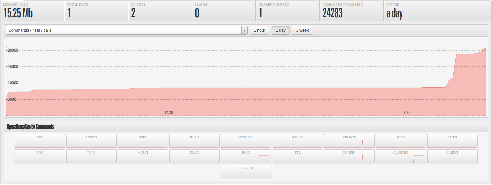
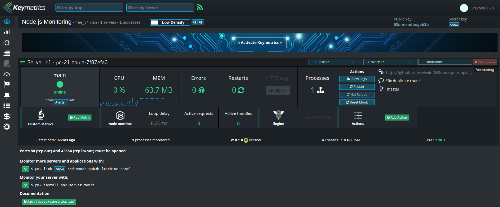

[](https://jenkins.sylvaindenyse.me/job/build_back-pocemploi)

# back-pocemploi
Handle data with Redis for [Poc'Emploi](https://github.com/clusson/poc-emploi) and [Microsoft Face API](https://docs.microsoft.com/en-us/azure/cognitive-services/face/overview).

### Description

###### Tracking datas : 
Datas are feeded via websocket, stored in redis database, and consumed by REST API.

###### Face API datas : 
Datas are received and sent via websocket.

### API Documentation
API documentation available at [*host*:*port*/documentation]().
We're using Swagger.

### Monitoring
Redis database incredibly monitored by [Redsmin](https://github.com/Redsmin).


Node.JS application monitored by [Keymetrics](https://keymetrics.io).



### Environment Variables
```bash
export REDIS_HOST=localhost
export REDIS_PORT=6379
export REDIS_PASSWORD=pwd

export HAPI_HOST=localhost
export HAPI_PORT=4444

export FACEAPI_URI=https://westcentralus.api.cognitive.microsoft.com/face/v1.0/detect
export FACEAPI_KEY=key1234567890
```
